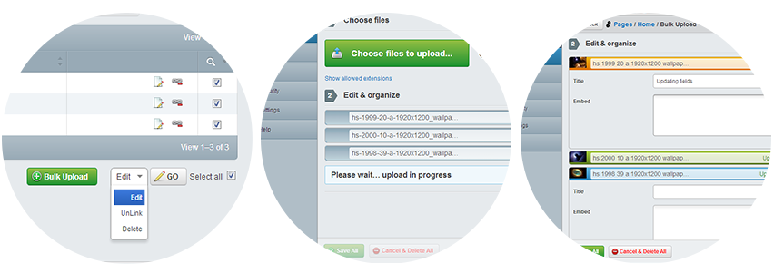

GridField Bulk Editing Tools
============================
Set of SilverStripe 3 GridField components to facilitate bulk file upload & record editing.

Components included:
* [Bulk Upload](#bulk-upload): Upload multiple images or files at once into DataObjects
* [Bulk Manager](#bulk-manager): Handles actions for multiple records straight from the GridField (comes with unlink, delete and edit)

[More screenshots here.](screenshots)

## Requirements
* SilverStripe 3.1 (version master / 2.+ / 1.+)
* Silverstripe 3.0 (version [0.5](https://github.com/colymba/GridFieldBulkEditingTools/tree/0.5))

## Development notes
The master branch will try to be compatible with the latest SilverStripe release/pre-release. Please submit pull request against the master branch. Older branches are kept for compatibility but are not maintained.

## Installation
* Download and copy module in SilverStripe root directory and name it whatever you want
* flush the manifest

## 2.0.0 deprecations
Major depractions in latest 2.0.0 release:
* The `GridFieldBulkImageUpload` has been renamed to `GridFieldBulkUpload`.
* `onBulkImageUpload` callback has been renamed to `onBulkUpload`

## Bulk Upload
Upload multiple images or files at once into DataObjects. Perfect for galleries and the like.

    $config->addComponent(new GridFieldBulkUpload());

See [BULK_UPLOAD.md](bulkUpload/BULK_UPLOAD.md) for detailed configuration.

## Bulk Manager
Perform actions on multiple records straight from the GridField

    $config->addComponent(new GridFieldBulkManager());

See [BULK_MANAGER.md](bulkManager/BULK_MANAGER.md) for detailed configuration.

## Interdependencies
The `GridFieldBulkUpload` component makes use of `GridFieldBulkManager` to allow quick editing of the newly uploaded files. Although not nescessary for the component to work, adding `GridFieldBulkManager` too to your `GridFieldConfig` will give you this advantage.

#### @TODO
* Add individual actions for each upload (update + cancel)
* Handle and display errors better for: creation, update, cancel

## Translations

Translations of the natural language strings are managed through a third party translation interface, transifex.com.

Please use [https://www.transifex.com/projects/p/gridfieldbulkeditingtools/](https://www.transifex.com/projects/p/gridfieldbulkeditingtools/) to contribute translations, rather than sending pull requests with YAML/JS files.

## License (BSD Simplified)

Copyright (c) 2013, Thierry Francois (colymba)

All rights reserved.

Redistribution and use in source and binary forms, with or without modification, are permitted provided that the following conditions are met:

 * Redistributions of source code must retain the above copyright notice, this list of conditions and the following disclaimer.
 * Redistributions in binary form must reproduce the above copyright notice, this list of conditions and the following disclaimer in the documentation and/or other materials provided with the distribution.
 * Neither the name of Thierry Francois, colymba nor the names of its contributors may be used to endorse or promote products derived from this software without specific prior written permission.
 
THIS SOFTWARE IS PROVIDED BY THE COPYRIGHT HOLDERS AND CONTRIBUTORS "AS IS" AND ANY EXPRESS OR IMPLIED WARRANTIES, INCLUDING, BUT NOT LIMITED TO, THE IMPLIED WARRANTIES OF MERCHANTABILITY AND FITNESS FOR A PARTICULAR PURPOSE ARE DISCLAIMED. IN NO EVENT SHALL THE COPYRIGHT HOLDER OR CONTRIBUTORS BE LIABLE FOR ANY DIRECT, INDIRECT, INCIDENTAL, SPECIAL, EXEMPLARY, OR CONSEQUENTIAL DAMAGES (INCLUDING, BUT NOT LIMITED TO, PROCUREMENT OF SUBSTITUTE GOODS OR SERVICES; LOSS OF USE, DATA, OR PROFITS; OR BUSINESS INTERRUPTION) HOWEVER CAUSED AND ON ANY THEORY OF LIABILITY, WHETHER IN CONTRACT, STRICT LIABILITY, OR TORT (INCLUDING NEGLIGENCE OR OTHERWISE) ARISING IN ANY WAY OUT OF THE USE OF THIS SOFTWARE, EVEN IF ADVISED OF THE POSSIBILITY OF SUCH DAMAGE.